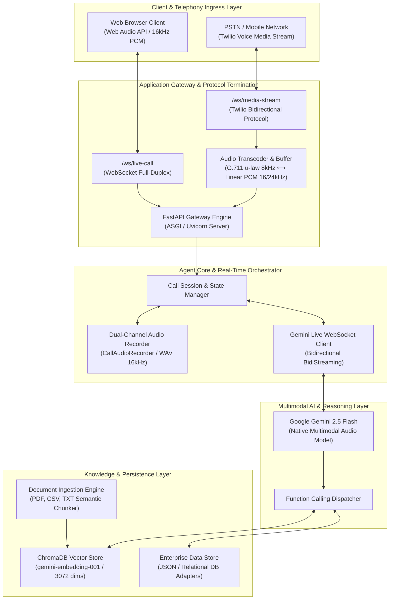
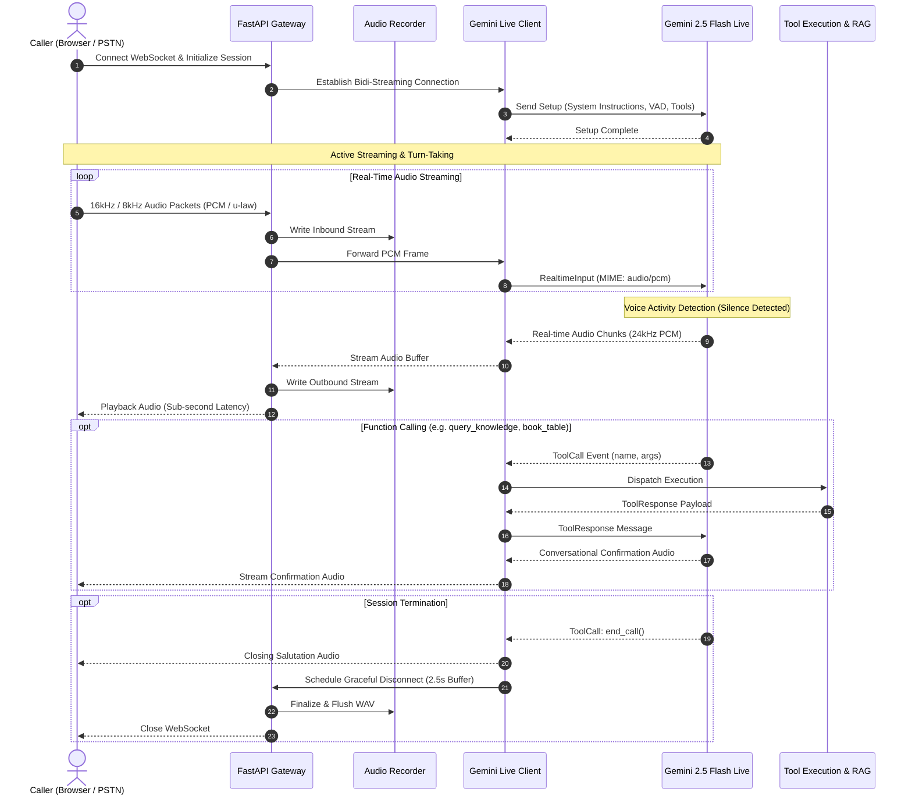

# APEX AGENT: Enterprise Real-Time Multimodal Voice Platform

APEX AGENT is an enterprise-grade, low-latency, bidirectional conversational AI platform engineered for mission-critical telephony and web voice workloads. Built on Google Gemini Live Multimodal Audio API, FastAPI, WebSockets, and ChromaDB Vector Store, APEX AGENT delivers sub-second voice-to-voice turnarounds without traditional STT-to-LLM-to-TTS pipeline compounding delays.

---

## Executive Summary

Traditional voice agents suffer from high latency (3–6 seconds) resulting from sequential Speech-to-Text (STT), Large Language Model (LLM) inference, and Text-to-Speech (TTS) synthesis. 

APEX AGENT utilizes a **Native Audio Multimodal Architecture**, processing streaming audio tokens directly in a full-duplex session. This reduces end-to-end silence-to-audio latency to **sub-1000ms**, enabling natural conversational cadence, immediate interruption handling (barge-in), contextual customer personalization, and enterprise tool execution.

---

## System Architecture

### High-Level Architectural Overview



---

## Detailed Sequence Flow

The following sequence illustrates the real-time interaction lifecycle between caller, gateway, Gemini Multimodal Live API, and backend tool execution.



---

## Technology Stack Specification

| Domain | Technology / Component | Version / Specification | Architectural Purpose |
| :--- | :--- | :--- | :--- |
| **Core Runtime** | Python | `>= 3.10` | Enterprise application runtime environment |
| **API Gateway** | FastAPI | `0.115.0+` | High-throughput asynchronous ASGI web and WebSocket server |
| **ASGI Engine** | Uvicorn | `0.30.0+` | Production ASGI HTTP/WebSocket server implementation |
| **AI Model** | Google Gemini 2.5 Flash | `gemini-2.5-flash-native-audio-latest` | Direct multimodal speech-to-speech reasoning and generation |
| **Embedding Engine** | Google Gemini Embeddings | `models/gemini-embedding-001` (3072 Dim) | High-resolution semantic vector embeddings |
| **Vector Database** | ChromaDB | `0.5.0+` | Local/Distributed embedded vector store with persistence |
| **Telephony Integration** | Twilio Voice Media Streams | G.711 $\mu$-law / 8kHz | Enterprise PSTN / SIP Trunking bidirectional voice stream |
| **Audio Processing** | Python `wave`, `audioop`, Web Audio API | 16-bit Linear PCM (16kHz / 24kHz) | Real-time audio transcoding, downsampling, and buffering |
| **Document Processing** | PyPDF, CSV DictReader, Custom Chunker | UTF-8 Streaming Chunking | Enterprise unstructured document ingestion for RAG |
| **Client Frontend** | Vanilla JavaScript / CSS3 / HTML5 | Responsive Dashboard & Simulator | Zero-framework footprint, enterprise operational console |

---

## Core Capabilities & Engineering Highlights

### 1. Zero-Pipeline Latency Architecture
- Direct ingestion of raw PCM audio chunks without intermediate STT transcription latency.
- Full-duplex WebSocket connection maintained directly with Gemini Live session.
- Turnaround time between caller speech cessation and AI speech generation consistently measured at **600ms – 1100ms**.

### 2. Intelligent Voice Activity Detection (VAD) & Barge-In
- Hardware-accelerated client-side silence gate coupled with server-side Gemini activity detection.
- Configured silence threshold (`silenceDurationMs: 950`, `prefixPaddingMs: 150`) prevents premature cut-offs during pauses while maintaining conversational snappiness.
- Real-time barge-in cancellation: incoming caller voice triggers an immediate playback stop signal to flush client audio buffers.

### 3. Dynamic Vector RAG & Knowledge Management
- Dynamic ingestion pipeline supporting `.pdf`, `.csv`, and `.txt` document uploads via administrative console.
- Recursive semantic chunking with overlapping context boundaries (`chunk_size=1000`, `overlap=150`).
- Dual-tier retrieval: Vector similarity search backed by ChromaDB with an In-Memory cache fallback for sub-millisecond retrieval.

### 4. Deterministic Function Calling & Enterprise Tools
- Structured tool execution integrated into the conversational graph:
  - `query_knowledge`: Vector search execution across enterprise documents and operating manuals.
  - `book_table`: Transactional reservation and scheduling engine.
  - `check_member_points`: Customer loyalty and CRM profile query.
  - `send_sms_info`: Outbound SMS notification dispatch.
  - `transfer_call`: Live call routing to human agents via Twilio Call Transfer.
  - `end_call`: Graceful conversational termination with delayed socket closure.

### 5. Dual-Track Session Auditing & Observability
- Automatic synthesis of caller audio and AI response into standardized dual-channel 16kHz WAV archives.
- Automated post-call intelligence generation: summary, customer sentiment extraction, and primary intent classification.

---

## Directory Structure

```text
AI_VOICE/
├── app/
│   ├── __init__.py
│   ├── main.py             # FastAPI entry point, WebSocket endpoints & REST controllers
│   ├── config.py           # Configuration schema and environment bindings
│   ├── audio.py            # Audio transcoding (G.711 u-law / PCM) and WAV recording
│   ├── gemini_client.py    # Gemini Live WebSocket protocol client, VAD, and Tool router
│   ├── twilio_client.py    # Telephony dispatch and call routing client
│   └── templates/
│       ├── index.html      # Enterprise Operations Console, RAG Manager & Analytics
│       └── phone_modal.html# iOS Telephony Simulator Component
├── data/
│   ├── call_logs.json      # Session audit trails, intent metadata, and sentiment records
│   ├── documents.json      # Metadata registry for ingested enterprise documents
│   ├── knowledge.json      # Structured business facts, operational policies, and FAQs
│   ├── reservations.json   # Transactional table bookings and scheduling records
│   └── chroma_db/          # Persistent ChromaDB vector indexes and metadata
├── recordings/             # Dual-track audio session recordings (.wav)
├── run.py                  # Production server startup script with UTF-8 enforcement
├── requirements.txt        # Production dependency manifest
├── .env.example            # Environment configuration template
└── README.md               # Enterprise system documentation
```

---

## Deployment & Production Configuration

### Prerequisites
- Python 3.10, 3.11, or 3.12
- Google AI Studio API Key with access to Gemini 2.5 Flash Native Audio
- (Optional) Twilio Account with Voice Media Streams enabled for PSTN integration

### 1. Environment Configuration

Create a production `.env` file from `.env.example`:

```bash
cp .env.example .env
```

Configure parameters within `.env`:

```env
# Google Gemini Credentials & Model Configuration
GEMINI_API_KEY="AIzaSyYourProductionGeminiAPIKey"
GEMINI_MODEL="models/gemini-2.5-flash-native-audio-latest"
GEMINI_VOICE="Aoede"

# Server Network Configuration
HOST="0.0.0.0"
PORT=8000
DEBUG=False

# Telephony Integration (Optional)
TWILIO_ACCOUNT_SID=""
TWILIO_AUTH_TOKEN=""
TRANSFER_NUMBER="+66812345678"
```

### 2. Dependency Installation

```bash
# Initialize isolated virtual environment
python -m venv venv

# Activate virtual environment
# Linux/macOS:
source venv/bin/activate
# Windows (PowerShell):
.\venv\Scripts\Activate.ps1

# Install production dependencies
pip install --no-cache-dir -r requirements.txt
```

### 3. Running the Server

#### Development / Local Verification:
```bash
python run.py
```

#### Production Deployment (Uvicorn / Gunicorn with Process Management):
```bash
uvicorn app.main:app \
  --host 0.0.0.0 \
  --port 8000 \
  --workers 4 \
  --ws-ping-interval 20 \
  --ws-ping-timeout 20 \
  --access-log
```

---

## Enterprise Production Guidelines

### Reverse Proxy & SSL Termination (Nginx Configuration)

Because modern web browsers mandate a Secure Context (`HTTPS` / `WSS`) for Web Audio API and microphone access, an Nginx reverse proxy with SSL termination must front the application:

```nginx
server {
    listen 443 ssl http2;
    server_name voice.yourdomain.com;

    ssl_certificate /etc/ssl/certs/voice_app.crt;
    ssl_certificate_key /etc/ssl/private/voice_app.key;
    ssl_protocols TLSv1.2 TLSv1.3;

    # Client application & REST APIs
    location / {
        proxy_pass http://127.0.0.1:8000;
        proxy_set_header Host $host;
        proxy_set_header X-Real-IP $remote_addr;
        proxy_set_header X-Forwarded-For $proxy_add_x_forwarded_for;
        proxy_set_header X-Forwarded-Proto $scheme;
    }

    # Bidirectional WebSocket Streaming
    location /ws/ {
        proxy_pass http://127.0.0.1:8000;
        proxy_http_version 1.1;
        proxy_set_header Upgrade $http_upgrade;
        proxy_set_header Connection "upgrade";
        proxy_set_header Host $host;
        proxy_set_header X-Real-IP $remote_addr;
        proxy_read_timeout 3600s;
        proxy_send_timeout 3600s;
    }
}
```

### Telephony Inbound Routing (Twilio TwiML)

To connect an enterprise phone number to the platform via Twilio, configure the incoming Voice webhook to return TwiML directing the call into the WebSocket stream:

```xml
<?xml version="1.0" encoding="UTF-8"?>
<Response>
    <Connect>
        <Stream url="wss://voice.yourdomain.com/ws/media-stream" />
    </Connect>
</Response>
```

---

## Verification & Operational Walkthrough

### 1. Operations Console & Simulator
1. Navigate to `https://voice.yourdomain.com` (or `http://localhost:8000` for local evaluation).
2. Open the **Console Sandbox** tab and initiate a call via the integrated Telephony Simulator.
3. Observe the real-time latency waterfall metrics:
   - **VAD Silence-to-Text Latency**: ~550ms – 650ms.
   - **Silence-to-Audio Output Latency**: ~900ms – 1100ms.
4. Speak naturally in Thai, English, or Japanese; the engine preserves language stickiness and contextual continuity throughout the session.

### 2. Knowledge Base Ingestion
1. Navigate to the **Configure (Admin)** tab.
2. Drag and drop PDF manuals, CSV product lists, or TXT documentation into the ingestion dropzone.
3. The server asynchronously processes the file, updates `documents.json`, computes vector embeddings, and registers the chunks in ChromaDB.
4. Subsequent queries immediately retrieve the new knowledge via semantic vector search.

### 3. Call Intelligence & Audit
1. Navigate to the **Calls & Reservations** tab.
2. Inspect completed session records including duration, caller identity, sentiment categorization, and detailed transcripts.
3. Click **Play Audio** to review the synchronized dual-channel audio recording stored in `recordings/`.

---

## Security & Compliance Architecture

- **Transient Audio Processing**: Audio streaming buffers exist strictly in-memory during active sessions; persistent disk writes are isolated to configured archival paths (`recordings/`).
- **Data Protection**: API keys, credentials, and telephony tokens are managed via environment variables and excluded from version control.
- **Sanitized Logging**: Production logs strip sensitive customer audio payloads while retaining necessary timing markers, tool call metadata, and session status diagnostics.

---

## License

APEX Scale Intelligence License — Engineered for deployment as a dedicated enterprise voice automation platform.
